#        :bookmark_tabs: **Classic Load Balancer A Mini Project**
### :pushpin:**Introduction**
This project demonstrates how to deploy an Classic Load Balancer(CLB) in linux. The Classic Load Balancer it act like Round-Robin traffic distribution method. The classic load balancer is used in monolithic architecture website. The main objective of this project was to learn how to deploy classic load balancer. Finally, The CLB name of the classic load balancer is copied and tested to verify traffic disributtion.

### :bulb:**Steps for Implement**

  #### **Step-1**: Launch  The Three Instance Server-1,Server-2,Server-3.:rocket:

* Click on the lauch instance.

* Create a instances Server-1.

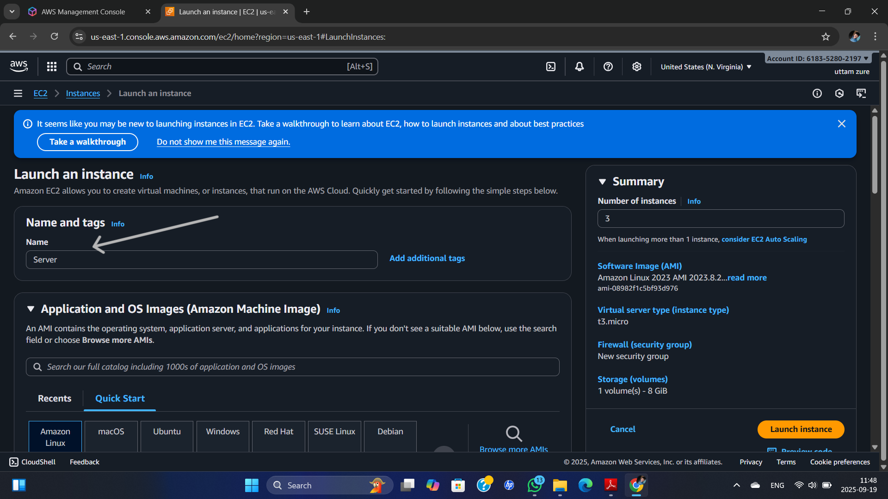

* Select the key pair.

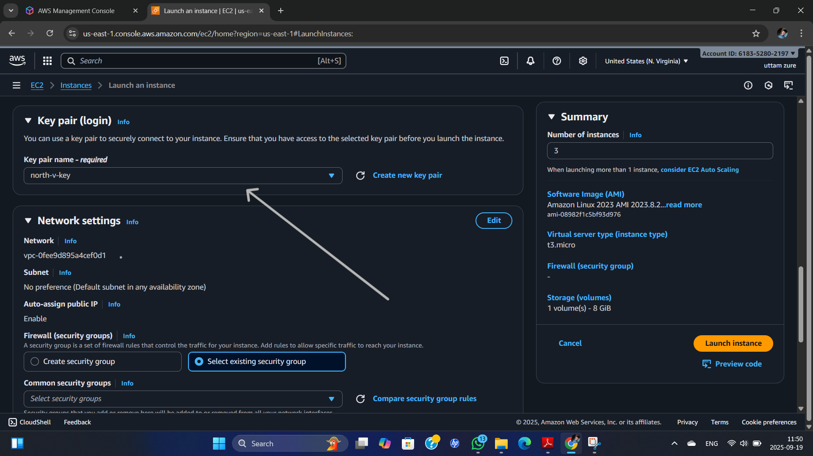
* Click on the advanced details.

* Go to user data optionl.

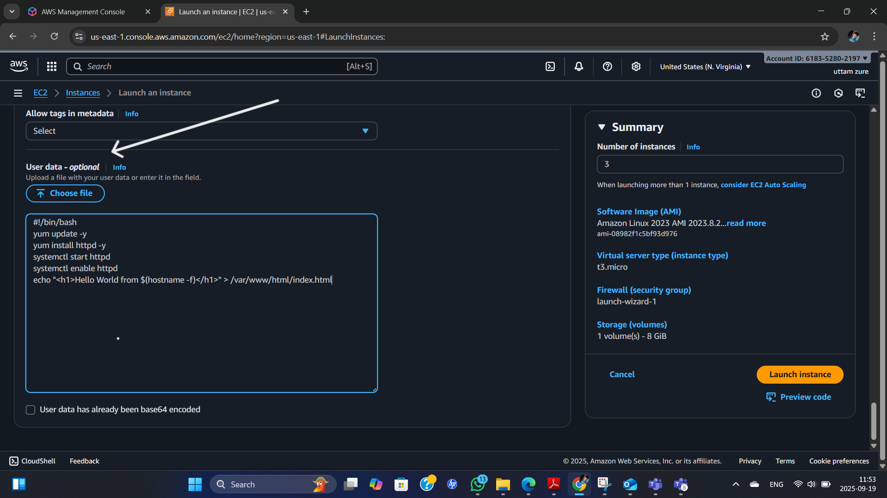

* Number of instance Three is creating the 3 instance.

* Click on the lanuch the instances.

* Edit the name of the server to server-1,server-2,server-3

#### **Step-2:** Create the load balancer.

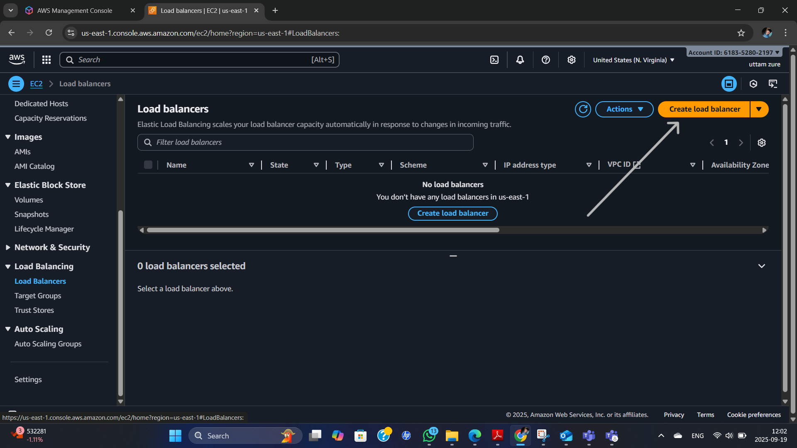

#### **Step-3:** Create the classic load balancer & create button.

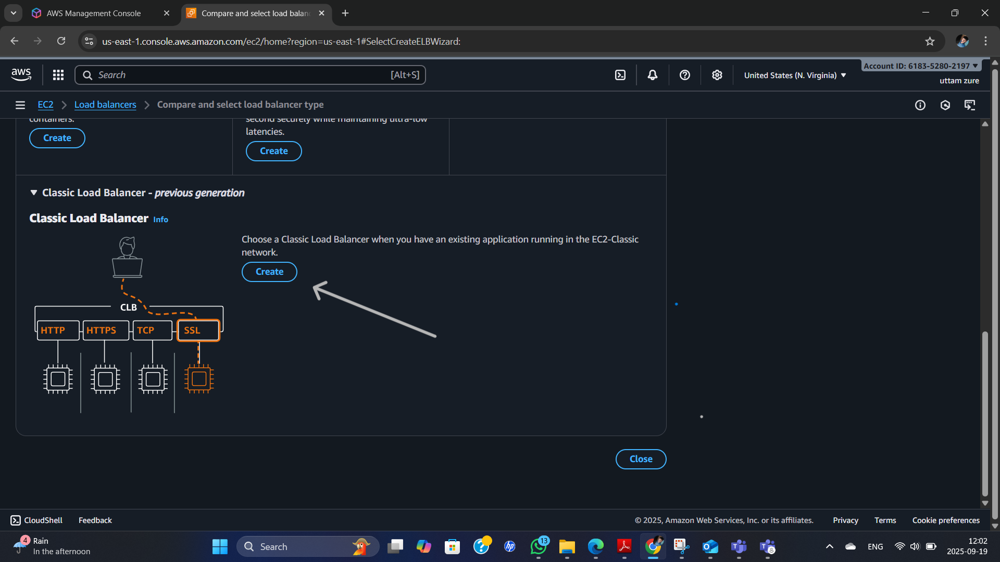

#### **Step-4:** Assign the name to the classic load balancer

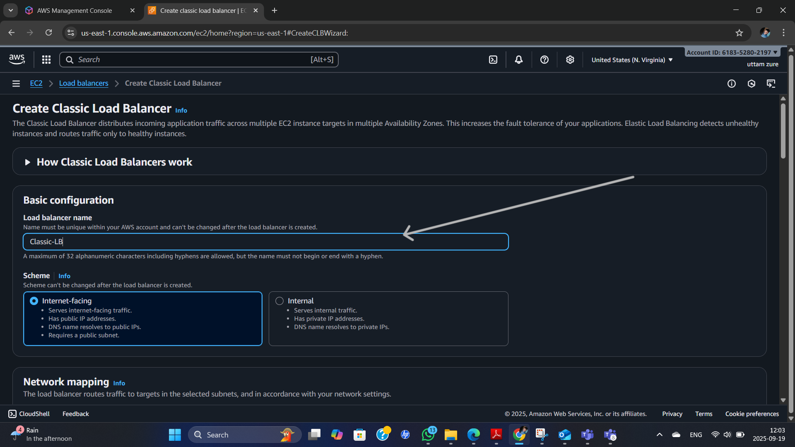

#### **Step-5:** Right click on the availability zones & subnets &Select the security group.:white_check_mark: 

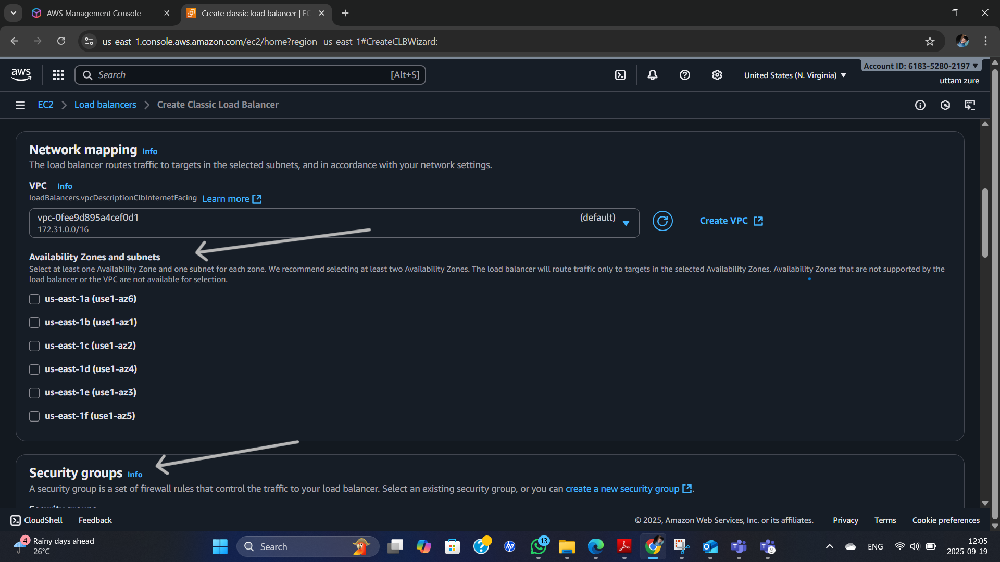

#### **Step-6:** Add The Instances & Available Instances.

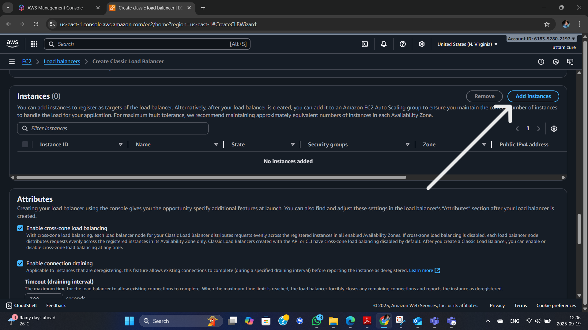
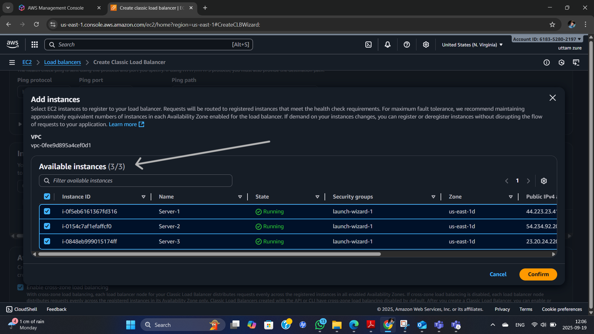

#### **Step-7:** click on the create loadbalancer.

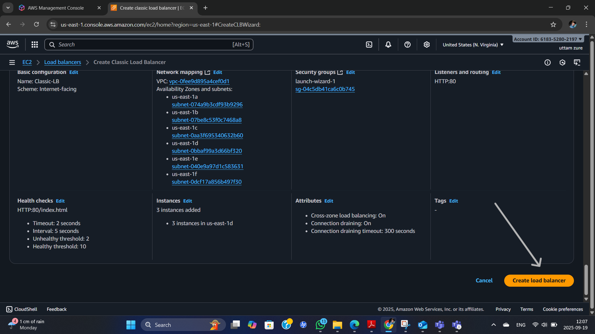

#### **Step-8:** Copy the DNS name of the CLB. :white_check_mark: 
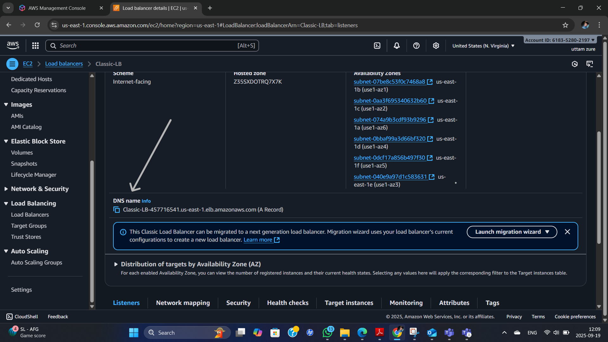

#### **Step-8:** 
## **:globe_with_meridians:Expected Output**
* Past CLB DNS name in the new incognito window.

* **Server-1**
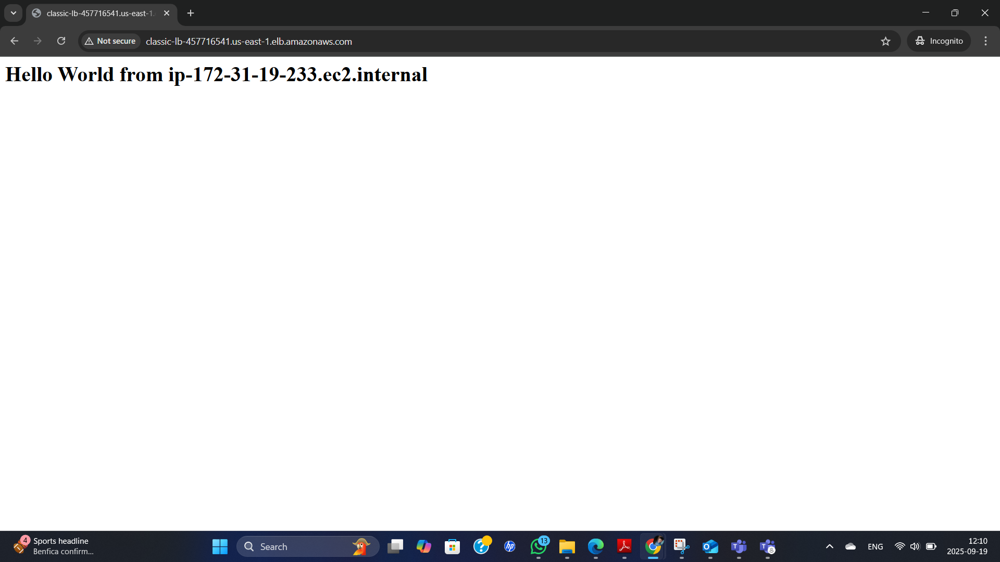

* **Server-2**
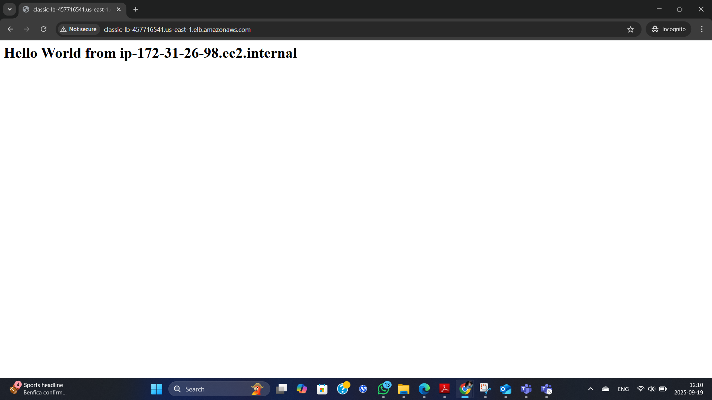

* **Server-3**

### :red_circle: **Summary (Classic Load Balancer) :-**

The Classic Load Balancer (CLB) is one of AWS’s legacy load balancing services. It operates at both Layer 4 (TCP) and Layer 7 (HTTP/HTTPS), distributing incoming traffic across multiple EC2 instances to improve application availability and reliability. CLB supports basic features such as SSL termination and sticky sessions, making it suitable for small to medium-scale applications. However, for modern and advanced workloads, AWS recommends using Application Load Balancer (ALB) or Network Load Balancer (NLB).